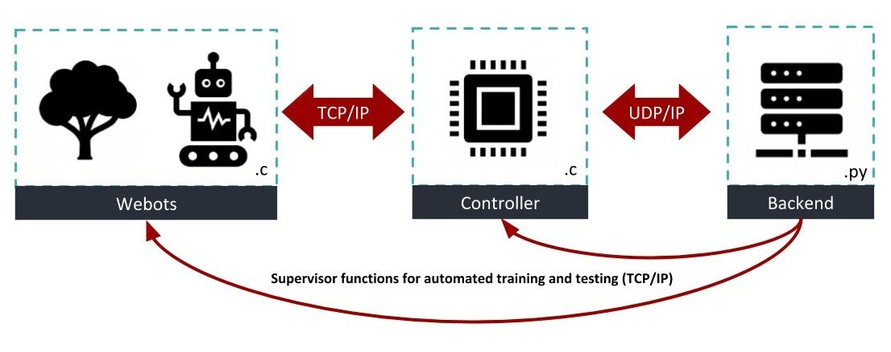

# EES-PEES Robot Project


  
(currently all failing because we ran out of Github Action minutes.)

## Architecture

The repository is split up into three main directories:
* `webots/` code that runs in the webots simulator / webots controller (C/C++).
* `controller/` code for the external controller (C/C++).
* `backend/` code for the backend (Python).

The organization and the overall architecture can be seen here:  


On top of the above mentioned three main directories we have the following directories:
* `scripts/` scripts to manually test the robot.
* `trainingruns/` contains model and logging data from out training runs.
* `UseMe/` prominent models and examples of our achievements.
* `.github/` CI scripts used by Github Actions.

For more information about each directory, its contents and its functions, please consult the corresponding readme found in each directory.

The `UserGuide.md` will help you set everything up and get started with our models and training.


## Version Control

We have three main branches with the same names as the three main directories (`webots`,`controller`,`backend`). Although they are not necessary, they simplify and streamline working on the different parts of our architecture while helping to prevent big merge conflicts. If we are ready for a system test, we will pull / merge all three (or only the needed) branches into the `master` branch. There we can work on getting the interfaces running and test the system as a hole.

The basic branch / merge architecture should look something like this:


**Please never merge branches between any of the three main "zones". Only merge between branches inside these zones or between the three main branches and the `master` branch. This way we can reduce the risk of merge conflicts as much as possible.**

If you want to test new crazy stuff, please do so in your own test branch. Please use your first name as the name for your test branch. After you are done testing you can copy or better merge your changes into one of the corresponding three branches.


## C/C++ Coding Guide
(Partially based on some guide from someones Github repository I cant remember.)

#### Whitespace
* Indent with tabs, not spaces.
* End file with a new line (as requested per C99 standard).
* Use empty line to divide code into logical chunks.
* Put spaces around binary operators : `x <= 2 && y > 10` is way easier to read than `x<=2&&y>10`.
* Put spaces after the following keywords : `if`, `switch`, `case`, `for`, `do`, `while`.

#### Placing braces
For this, we will follow the good old prophets of C : Kernighan and Ritchie.
It also happens to be the rule of the Linux Kernel.
The way the prophets taught us is to put the opening brace last on the line and the closing brace first :

```cpp
if (x == 42) {
    // do stuff
}
```

Note that the closing brace is always on its own line except if it is followed by a continuation
of the same statement, for example in a `do..while` block or in an `if..else` block :

```cpp
if (x == 42) {
    // do stuff
} else if (x == 34) {
    // do something else
} else {
    // do yet another thingie
}
```

```cpp
do {
    // do stuff
} while (x < 42);
```

Function definitions look like this :

```cpp
void do_something_useful(void) {
    // Code goes here
}
```

Always use braces.
This avoids mistakes and improves readability, without costing much of your time.
Don't do this :

```cpp
if (x == 42)
    do_stuff();
```

But this :

```cpp
if (x == 42) {
    do_stuff();
}
```

#### Naming conventions
* Do *not* use CamelCaseNotation, use underscore_notation instead.
* Short variable names are ok if they are still understandable : `i` is ok for a loop counter, but `foo` for a function name isn't.
* If you *really* need a global variable, but it can live with file-only scope, declare it with the `static` keyword.

#### File Structure
* Put all globally needed function declarations, variable declarations and `#define`s in a `.h` file.
* Put all locally needed function declarations and `#define`s in a `.c` file with the same name.
* Put all function implementations in the `.c` file with the same name.  
* Use classic `#ifndef` include guards in header files (as seen below).
* This way the code interface and implementation are cleanly separated.

#### Interaction with C++
(Only applicable if using C and C++ together.)

To allow for easy inclusion of your headers in C++ files, you should put `extern "C"` in your header.
If you don't do this, you will get weird link time error because of C++ name mangling.

For example:
```cpp
#ifndef MYHEADER_H_
#define MYHEADER_H_

#ifdef __cplusplus
extern "C" {
#endif

/* Snip */

#ifdef __cplusplus
}
#endif
#endif
```

## Python Coding Guide
Follow Pep8 coding guidelines: https://www.python.org/dev/peps/pep-0008/ <br>
Atom package: https://atom.io/packages/linter-python-pep8
