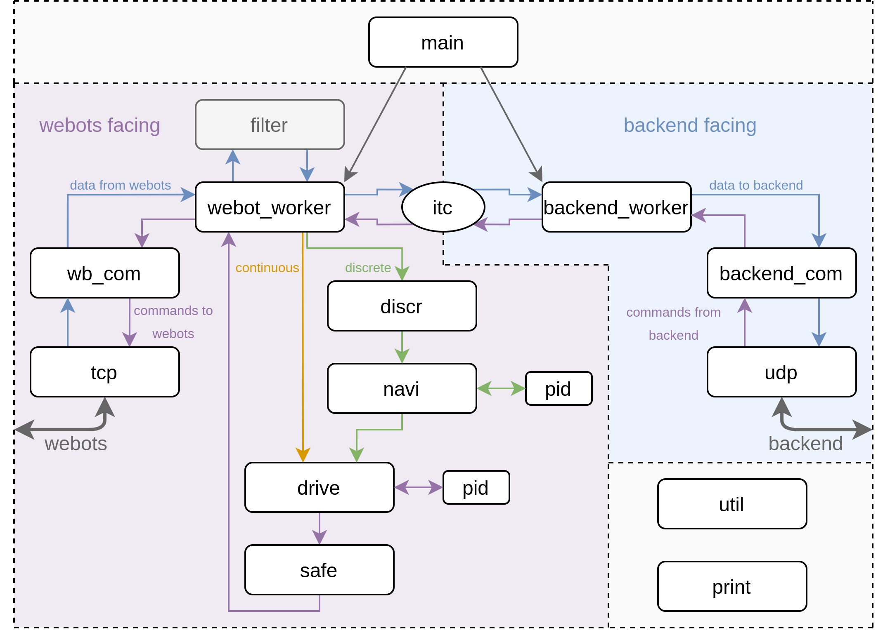

# EES-PEES Robot Project Controller


## Architecture
The controller code is split up into three directories:
* `include/`, headers that define the interface of every source file.
* `src/`, the source files, including the main entry point `main.c`.
* `test/`, where the source files for testing reside in.

The `src/` and `include/` directories are further split into a `webots` directory controlling the communication and logic with the robot in webots and the `backend` directory that handles communication with the backend.

A general data flow diagram can be seen here:



`main` launches the `webots_worker` and the `backend_worker`. They in turn establish a connection using `wb_com`/`tcp` and `backend_com`/`udp` respectively. Data then flows from "left to right" and uses the itc structs to cross between the webot facing and the backend facing side. Commands travel from "right to left" and also use the itc structs. Depending on whether the command is continuous or discrete it takes a slightly different path through the "control chain" which computes the appropriate control output that is send to the robot in webots.

We also have a `Makefile` to compile the code in the root directory.

## General functioning
The external controller consists of two parallely running threads, `webot_worker` and `backend_worker`. Both of them communicate by using externally defined message (itc) structs that are protected from simultaneous access using mutexes. The general idea is that the `webot_worker` receives sensor data from the robot in webots, re-formats it to the format the backend needs and puts it into the corresponding above mentioned message struct for the `backend_worker` to read it. Then it continues to read the values the `backend_worker` left for it and uses those to calculate the new motor control settings for the robot using a PID controller and do safety logic. Afterwards it sends the new commands to the webots controller. At the same time the `backend_worker` waits for the backend to either request the newest sensor data, send updated speed and heading, or both.

The `webot_worker` works at the frequency of the simulation, so it does one loop per timestep. The `backend_worker`, on the other hand, works at a variable frequency, determined by the request type used by the backend (see below for more information).

## Usage
Use the `Makefile` in the root directory to compile the code. A new `build` directory will be created. The build directory is not part of the version control system and should not be added or commited via git (we have `/build` added to our `.gitignore`). You can then execute the resulting binary file called `controller` in the `/build` directory.

```
make
./build/controller
```

To get a clean start (delete all build files):

```
make clean
```

## Testing
We are using [Google Test](https://github.com/google/googletest) to run unit tests on our code. Before you will be able to run any tests you will need to install Google Test on your machine. Please follow the installation instructions [here](https://www.eriksmistad.no/getting-started-with-google-test-on-ubuntu/) to install Google Test. After that you will be able to call `make test`. That will compile and run all unit tests. You can add your own unit tests in the `/test` directory. You may need to create a new corresponding test file in that directory if there is none already. The tests will also be automatically executed when pushing to Github using [Github Actions](https://help.github.com/en/actions).


## Protocol

* IP `127.0.0.1` (local host)
* Controller Port `6969`
* Backend Port `6970`
* Webot Port `10200`


### Webots
The communication with the robot in webots uses a TCP connection. There are three different packages that can be send on this connection:
* init messages that are send once at the startup of the internal controller to the external controller.
* webot --> external controller messages that consist of the current sensor data the robot sends every timestep.
* webot <-- external controller messages that consist of the speed and heading the robot should configure its motors to.

###### init msg --> external controller
```
typedef struct {
	int timestep;               // timestep length (in ms) of the simulation
	double maxspeed;            // maximum rotational speed of the robots drive axle
	double lidar_min_range;     // minimum detection range of lidar. Obstacles closer will be shown at max range
	double lidar_max_range;     // maximum detection range of lidar
}__attribute__((packed)) init_to_ext_msg_t;
```
* `timestep` actual time (in ms) that passes in the simulation with each simulated step. It is defined by the webots world. Sensor data does not change in intervals smaller than this.
* `maxspeed` defines the maximum speed the robot motor can rotate the axle at. This is used solely to scale the used speeds to an interval of -1 to 1.
* `lidar min and max range` are the ranges in which the lidar detects obstacles. Values below or above this value are reported at the lidar_max_range value. These values are subject to noise and can differ from the max value.

###### webot --> external controller
```
typedef struct {
	double sim_time;            // current simulation time in seconds
	double current_speed;       // current robot speed (without direction)
	double steer_angle;         // current angle of the steering apparatus [-1, 1]
	double actual_gps[3];       // coordinates where the robot is
	double compass[3];          // direction the front of the robot points in
	float distance[DIST_VECS];  // distance to the next object from robot perspective
} __attribute__((packed)) data_from_wb_msg_t;
```
* `sim_time` is the current time (in seconds) starting at 0 when the simulation starts.
* `current_speed` is the robots current speed (in m/s) measured by the gps (without direction).
* `steer_angle` is the current angle of the steering axle (from -1 for fully left, to +1 for fully right).
* `compass` gives back a 3D vector pointing in the direction the robot points. This is used to calculate the heading of the robot and whether or not it is upright.
* `distance` is the data from the lidar sensor where the first entry is in the back of the robot and the following entries are in clockwise direction.

###### webot <-- external controller
```
typedef struct {
	double heading;             // the direction the robot should move in next, between -1 and 1
	double speed;               // the speed the robot should drive at, between -22 (forwards) and 22 (backwards)
} __attribute__((packed)) cmd_to_wb_msg_t;
```
* The `heading` value tells the robot to which angle it should position its back axle. It ranges from -1 to 1, with 0 being straight.
* `speed` gives the webots motor a value. It should be between -max_speed and +max_speed. Negative numbers mean the robot is driving forwards (ONLY INTERNALLY, values from backend should have the more intuitive positive=forward format).


### Backend
We use two types of messages. One that transmits the current data to the backend agent and the response the agent sends back to the controller containing a new command and command type.
Variables inside the messages with `(internal)` next to them should never be written by the application. These get filled by the transmission protocol. They can however be read.

The backend protocol is run over udp to ensure real time behavior. On top of udp we have build several error detection mechanisms that allow us to determine the quality of our connection and then act appropriately.

##### external controller --> backend
```
typedef struct {
	unsigned long long msg_cnt;    // total number of messages (internal)
	double time_stmp;              // time the message got send (internal)
	float sim_time;                // actual simulation time in webots in seconds
	float speed;                   // current speed of robot in webots [-1, 1]
	float actual_gps[2];           // coordinates where the robot is
	float heading;                 // direction the front of the robot points in [-1, 1]
	float steer_angle;             // current angle of the steering apparatus [-1, 1]
	unsigned int touching;         // is the robot touching something or tipped over
	unsigned int action_denied;    // did we have to take over control for saftey reasons
	unsigned int discr_act_done;   // did the robot complete its discrete action
	float distance[DIST_VECS];     // distance to the next object from robot prespective
} __attribute__((packed)) data_to_bcknd_msg_t;
```

* `unsigned long long msg_cnt` is a running count of all transmitted messages between controller and backend. They start at 0.
* `double time_stmp` is the local system time in seconds (with nanosecond precision) since 1970. It gets set just before the message gets send out.
* `float sim_time` Actual simulation time in webots in seconds.
* `float speed` Current speed of robot in webots [-1, 1].
* `float actual_gps[2]` are the coordinates the robot is currently at. It is in the same format as the `target_gps`.
* `float heading` the direction the front of the robot is currently pointing at [-1, 1].  
* `float steer_angle` current angle the of the steering apparatus that the robot uses to steer [-1, 1].
* `unsigned int touching` is set to 1 of there is an obstacle closer to the robot than the silhouette defined in `silhouette.h` and set to -1 if the robot is tipped over.
* `unsigned int action_denied` is set if the external controllers safety needed to take over control because backend action was not safe.
* `unsigned int discr_act_done` is set when the requested discrete action is done.
* `float distance[DIST_VECS]` the distance (in meters) to the next solid object with the direction corresponding to the index of the array. So if distance[66] = 1.23, the distance to the next solid object in direction 66 degree is 1.23 meters. The maximum range of the lidar is about 3.5 meters. All values bigger than that have to be assumed to be invalid. The value at index 0 corresponds to the back of the robot, index increases in clockwise direction.

##### external controller <-- backend
```
typedef struct {
	unsigned long long msg_cnt;    // total number of messages (internal)
	double time_stmp;              // time the message got send (internal)
	int every_x;                   // number of timesteps before new data is send
	int disable_safety;            // do not use safety in the external controller
	enum response_request request; // type of response the backend awaits to the packet
	enum discrete_move move;       // ignore command parameters and do a discrete_action
	enum direction_type dir_type;  // heading or steering command from backend
	float heading;                 // the direction the robot should move in next [-1, 1]
	float speed;                   // the speed the robot should drive at [-1, 1]
} __attribute__((packed)) cmd_from_bcknd_msg_t;
```

* `unsigned long long msg_cnt` more info see above.
* `double time_stmp` more info see above.
* `every_x` number of timesteps the controller should wait until it sends new data (only used in the `COMMAND_REQUEST` type, for more info see below).
* `disable_safety` if this is set, the safety logic in the external controller is disabled.
* `enum response_request request` type of response the backend expects. More info see below.
* `enum discrete_move move` if this is set to a non zero value the heading and speed are ignored and a discrete action according to the move number is taken. If the action is done, the `discr_act_done` variable is set.
* `enum direction_type dir_type` heading or steering command from backend. More info see below.
* `float heading` the direction the robot should move in next [-1, 1] (interpretation depends on direction_type, more info see below).
* `float speed` the speed the robot should move at, 0 if it should stop [-1, 1].

###### Response-request behaviour
```
enum response_request {
	UNDEF = 0,                  // Invalid Packet
	COMMAND_ONLY = 1,           // Only new instructions for Robot, dont send next packet
	REQUEST_ONLY = 2,           // Only request for new packet
	COMMAND_REQUEST = 3,        // New instructions for robot AND request for new packet
	GRID_MOVE = 4               // Send new packet once discrete action is done
};
```
* `UNDEF` invalid Packet. Wait for next message from backend.
* `COMMAND_ONLY` only forward heading and speed to `webot_worker`, then wait for next message from backend.
* `REQUEST_ONLY` only send newest sensordata from `webot_worker` to backend, then wait for next message from backend.
* `COMMAND_REQUEST` forward heading and speed to `webot_worker`, then wait for `every_x` timesteps before sending the most current sensordata to the backend.
* `GRID_MOVE` forward a `discrete_move` to the `webot_worker`, then wait for the `discrete_action_done`-flag to be set. Once that is done, send the most current sensordata to the backend.

###### Discrete move
```
enum discrete_move {
	NONE = 0,                   // Dont do a discrete move at all, do continous
	UP = 1,                     // Move Up
	LEFT = 2,                   // Move Left
	DOWN = 3,                   // Move Down
	RIGHT = 4                   // Move Right
};
```

* `NONE` do not do any discrete move. Just do actions according to the heading and speed values in the packet.
* `UP` do a discrete move and move one step up in the webots world (north).
* `LEFT` do a discrete move and move one step left in the webots world (west).
* `DOWN` do a discrete move and move one step down in the webots world (south).
* `RIGHT` do a discrete move and move one step right in the webots world (east).

###### Direction type
```
enum direction_type {
	STEERING = 0,               // The backend commands the steering of the robot
	HEADING = 1,                // The backend commands the heading the robot should drive in
};
```

* `STEERING` the backend commands the robot to move its steering aparatus in a certain way. The backend steers the robot itself. (No help from PID controllers)
* `HEADING` the backend commands the robot to move in a certain direction. The robot then uses PID controllers to ensure that it is going in that direction.
