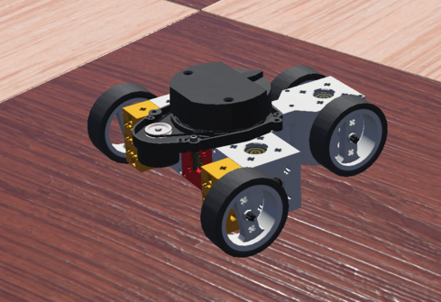

# Safe Reinforcement Learning 1
Mats Kipper | Jonas Dommes | Shanshan Yin | Fabian Peddinghaus | Rui Li | Wladimir Assmann | Per Joachims

## Project overview
In this project, we tackled the autonomous driving of a robot to a predetermined goal in the open-source robot simulation software [Webots](https://www.cyberbotics.com/). Our software tries to mimic realistic training by sending data via UDP/TCP between all components.

### Goals
At the start of our project, our goal was to create a robot in Webots that learns to reach a target in an unknown environment. Furthermore, it was supposed to avoid crashes, even while training. We set the goal to simulate sensor noise and add solutions to handle communication failure.

However, the complexity of a continuous world necessitated lots of experiments with the reinforcement learning agent. Therefore, we decided to create an environment where we can flexibly change parameters both relating to the overall world and the way the agent interacts with the robot. Additionally, we enabled the robot to move in the checkerboard-like tiled world.

### Requirements
In this project we were required to have seperated entities for the webot and external controller, both of which were supposed to be written in C/C++. Furthermore the backend, implemented in Python, was supposed to be the third independent part. The communication between them ought to happen using a networking interface. Using this the robot had to be able to reach a relatively small gps target in a world filled with obstacles, while acting "safe" in regard to not crashing into obstacles.

### Approach
In this project, we focused on building an infrastructure to apply existing and well-documented reinforcement learning algorithms to train and apply to Webots. Our approach was to work simultaneously on the Webots/controller and backend. Our project can roughly be separated into three phases:
1. Set up the whole communication from the internal controller through the external controller to the backend. Build a FakeGym to generate learnings about both the process of creating a custom gym and reinforcement learning basics.
2. Create an automation protocol to create randomized worlds and autonomously run the training. Improve the performance of the agent in the FakeGym.
3. Create a grid-based Webots world to reduce the complexity for the agent and allow for transferable learnings made in the FakeGym. Conduct experiments in the continuous gym. Implement safety logic in the external controller.

## System architecture
To simulate the realistic behavior of a robot performing actions, we split our software into controllers - internal and external - and backend. The external controller communicates with the backend and sends commands to the internal controller, which merely executes them. In a real design, both would run on the robot hardware. The backend, running on an external server, is responsible for evaluating sensor data to generate actions. To simplify the learning process we build a wrapper around our whole architecture to create a custom extension of OpenAI Gym. This *WbtGym* can be used with any algorithm from [stable baselines](https://stable-baselines.readthedocs.io/).

### Software design
To showcase our *communication*, let us examine how an action is generated and executed. The robot is randomly placed in a world and observes its environment using sensors. This sensor data is forwarded to the external controller via TCP/IP. The external controller formats and slightly extends the data and sends it via UDP/IP to the backend. In the backend an agent calculates a corresponding action maximizing a reward function. This action is sent to the external controller, who in turn interprets and forwards the action. The internal controller performs the action by setting motor speeds. This process is done iteratively until the robot reaches its predefined goal or we stop the run.

Specifically, we have three patterns of communication between the backend and the external controller:
* Send an action *or* ask for new data
* Send an action *and* ask for new data after some number of Webots time steps
* Perform a grid move and get new data once this move is fully executed by PID controller

An action is a tuple (direction, speed), consisting of two floats in [-1, 1]. The external controller interprets the direction value as *steering* or *heading*. The former directly sets the steering angle of the robot, the latter defines a cardinal direction in which the robot should move. In the *heading* mode the external controller sets the steering angle accordingly. These different modes can be tested nicely via the keyboard-control in our scripts. Further, we can specify *absolute* or *relative* actions, where *absolute* means just forwarding the action while *relative* leads to changing the last action by a set amount.

To train a reinforcement learning agent, we need a substantial amount of training runs. Even in our - quite simple - FakeGym the robot requires about 500 to 1,000 different environments to learn. To generate random worlds, we created an *automation* protocol between the backend and the internal controller. Using this we can start all components and create a random world in Webots with a set amount of obstacles and size. More importantly, we can end a training run and reset the world when we need to. This way our *WbtGym* resembles the OpenAI Gym's.

### Robot design
We wanted our robot to behave similar to a self driving car. Therefore, we build it with a drive axle and a steering axle. This way the robot does not need to stop to turn which leads to smooth driving. While this made solving the grid-based environment more difficult, we did not want to change our initial design. Instead, we implemented a "drive logic" that made the robot drive from tile to tile.
To observe the environment of the robot we used different sensors:
* A lidar sensor on top, similar to those used for autonomous cars, to detect obstacles in all directions.
* A compass to determine the direction the robot is pointing at.
* A gps module to determine the robots current position and speed.
* A sensor to determine the current position of the steering axle.
In the following picture only the lidar sensor on top is visible.

### Environment design
Our worlds are randomly generated based on a grid system. The robot and the target are both placed in the middle of a tile. Obstacles are boxes the same size as a tile and placed within ones. This allowes us to use the same worlds for our grid-based and continuous approaches. It also assures that there is enough space between to obstacles for the robot to move through. This constitutes a simplification that was neccessary to use transfer learning from the *FakeGym* and therefore speed up the training process substantially.
The backend can control both the world size and the number of obstacles. Additionally it is possible to use a constant seed to generate a specific world multiple times. However using the same environment for learning leads to the robot to merely memorize its surrounding and a path to the goal, instead of generalizing to be able to solve unknown situations aswell.

### Algorithms
As described in our software design, we build a custom environment following the interface of the OpenAI gym. The required functionality (see also: [stable-baselines custom environments](https://stable-baselines.readthedocs.io/en/master/guide/custom_env.html)) for custom environments consists of:
* *action_space* defines the possible actions for a robot, e.g. discrete of continuous actions. This is set in our action_class. We provide both options and the possibility to use a custom action class.
* *observation_space* defines the size of the observation. Can be customized as well.
* *step(action)* applies the action from the reinforcement learning agent to the environment. This is handled by mapping the action with the action_class and sending it via the external controller to Webots.
* *reset()* is used to randomly create new worlds where the robot can train in after the current run has ended.
* *render()* normally renders the environment. This is not needed for us.
* *close()* terminates the training.

Further, we included the option to use a custom reward function with the evaluate_class as parameter for the WbtGym.

Our *WbtGym* can be used with any algorithm from [stable-baselines](https://stable-baselines.readthedocs.io/). After numerous experiments in our *FakeGym* - in turn an extension of the OpenAI gym - we decided to use the *PPO1* algorithm for training.

## Summary
In our project we have **achieved** the following goals:
* Setup Webots world and the whole communication from the internal controller to the external controller to the backend.
* Incorporate a safety layer to fulfill the requirement of **safe** reinforcement learning environment where the robot does not crash even while training
* Build a wrapper around Webots with the interface of the OpenAI gym, enabling us to train any algorithm from stable baselines.
* Build a *FakeGym* to generate learnings, train models, and apply transfer learning.
* Apply a PPO1 trained on the *Fakegym* on our *WbtGymGrid*.
* Automatically train in our *WbtGym*.

Before this project, we all did not have a lot of exposure to reinforcement learning. Therefore, we might have started a bit too optimistic and have **not attained** the following goals:
* Successfully train a PPO1 in a continuous randomized world. Compared to grid based worlds, training in continuous environments takes a substantially larger amount of time and requires good hardware. For example, testing a small tweak in the reward function can take more than a night to evaluate. We are convinced that with more time and experiments, this problem is solvable with the infrastructure we build.
* The subsequent and optional goals such as incorporating sensor noise to make the communication even more realistic or adding a second robot were not attained as they would have complicated the continuous training process even more.

### Lessons learned
As all of us did not have a lot of prior knowledge regarding reinforcement learning projects, we decided to take the agile approach to this project to flexibly direct our work to the most meaningful areas. Further, in this summer, only virtual teamwork was possible due to COVID-19. This was especially challenging and created some organizational overhead. We experienced that weekly meetings with stand-ups as well as sprints with a length of about two (TODO: three?) weeks were optimal to balance teamwork, flexibility and long-term progress. Further, we learned a great deal about tackling reinforcement learning projects and their computational requirements.
For this project, we naturally used git with GitHub. For some of us this was the first project with more than three team members and we could expand our knowledge about git, especially regarding branching and GitHub actions. This is an essential skill for our future work environment.

### Future work
If we were to continue this project, we would further try to solve the problem of reaching the target in a continuous world with continuous actions and observations. Further, it would be challenging and interesting to increase the complexity of the world even further and come closer to modeling realistic self-driving cars.
