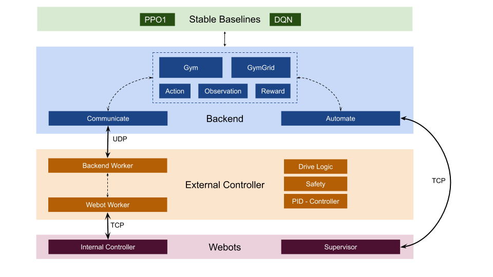

# Safe Reinforcement Learning 1
Mats Kipper | Jonas Dommes | Shanshan Yi | Fabian Peddinghaus | Rui Li | Wladimir Assmann | Per Joachims

## Project overview
<!-- A **short** summary of your project topic. -->

### Goals
At the start of our project our goal was to create a robot in webots that can learn to reach a target in a unknown environment. Furthermore, it was supposed to avoid crashes, even while learning. We set the goal to simulate sensor noise and add solutions to handle communication failure.

However, the complexity of a continuous world neccessitated lots of experiments with the reinforcement learning agent. Therefore, we decided to create an environment where we can flexibly change parameters both relating to the overall world and the way the agent interacts with the robot. Additionally, we enabled the robot to move in the checkerboard like tiled world.

- reach target autonomosly in randomzied world (otherwise just memorization)
- safety
- lots of options + flexibel

### Requirements
<!-- List the **necessary** and **optional** requirements that were set for your project.
- Safe Exploration while training -->
 - webot ctrl, external ctrl and backend agent have to be divided (c/python) to simulate realistic behaviour
 - world with small gps target and obstacles

### Approach
In this project we focused on building an infrastructure to apply existing and well documented reinforcement learning algorithms to train and apply to Webots. Our approach was to work simultaneously on the Webots/controller and backend. Our project can roughly be seperated into three phases:
1. Set up the whole communication from internal controller to external controller to backend. Build a FakeGym to generate learnings about both the process of creating a custom gym and reinforcement learning basics.
2. Create a automation protocol to create randomized worlds. Improve the performance of the agent in the FakeGym.
3. Create a grid-based Webots world to reduce the complexity for the agent and allow for transferable learnings made in a the FakeGym Conduct experiment in the continuous gym.
<!-- How have you tried to meet the above requirements? What were your ideas? -->

## System architecture
To simulate a realistic behaviour of a robot performing actions, we split our software into controllers - internal and external - and backend. The external controller communicates with the backend and sends commands to the internal controller, which merely executes them. In a real design both would run on the robots hardware. The backend, running on an external server, is responsible for evaluating sensor data to generate actions. To simplify the learning process we build a wrapper around our whole architecture to create a custom extension of OpenAI Gym. This *WbtGym* can be used with any algorithm from [stable baselines](https://stable-baselines.readthedocs.io/).

### Software design
To showcase our *communication*, let us examine how an action is generated and executed. The robot is randomly placed in a world and observes its environment using sensors. This sensor data is forwarded to the external controller via TCP/IP. The external controller formats and slightly extends the data and sends it via UDP/IP to the backend. In the backend an agent calculates a corresponding action maximizing a reward function. This action is send to the external controller, who in turn interprets and forwards the action. The internal controller performs the action by setting motor speeds. This process is done iteratively until the robot reaches its predefined goal or we stop the run.

Specifically, we have three patterns of communication between the backend and the external controller:
 * Send an action *or* ask for new data
 * Send an action *and* ask for new data after some number of Webots timesteps
 * Perform a grid move and get new data once this move is fully executed by PID controller

An action is tuple (direction, speed), consisting of two floats in [-1, 1]. The external controller interprets the direction value as *steering* or *heading*. The former directly sets the steering angle of the robot, the latter defines a cardinal direction in which the robot should move. In the *heading* mode the external controller sets the steering angle accordingly. This different modes can be tested nicely via the keyboard-control in our scripts. Further, we can specify *absolute* or *relative* actions, where *absolute* means just forwarding the action while *relative* leads to changing the last action by the set amount.

To train a reinforcement learning agent, we need a substantial amount of training runs. Even in our - quite simple - FakeGym the robot requires about 500 to 1,000 different environments to learn. To generate random worlds, we created an *automation* protocol between the backend and the internal controller. Using this we can start all components and create up a random world in Webots with a set amount of obstacles and size. More importantly, we can end a training run and reset the world when we need to. This way our *WbtGym* ressembles the OpenAI Gym's.

### Robot design
- look like picture
- 2 sachen erreichen, speed change, direction change independently -> models normal driving -> quite hard
-> able to work in grid as well as continues environment
- Welche Sensors und Warum erklaerung

### Environment design
- grid based (simplification) world + obsracles + starting poits etc -> continuous/grid in same environment
-  important parameters
- randomized

<!-- What does the environment look like in which your robot operates?
*The same: **Why** did you choose this environment? -->

### Algorithms
As described in our software design, we build a custom environment following the interface of the OpenAI gym. The required functionality (see also: [custom_gym](https://stable-baselines.readthedocs.io/en/master/guide/custom_env.html)) for custom environments are:
* *action_space* defines the possible actions for a robot, e.g. discrete of continuous actions. This is set in our action_class. We provide both options as well as the possibility to use a custom action class.
* *observation_space* defines the size of the observation. Can be customized as well.
* *step(action)* applies the action from the reinforcement learning agent to the environment. This is handled by mapping the action with the action_class and sending it via the external controller to Webots.
* *reset()* is used to randomly create new worlds where the robot can train in after the current run has ended.
* *render()* normally renders the environment. This is not needed for us.
* *close()* terminates the training.

Further, we included the option to use a custom reward function with the evaluate_class as parameter for the WbtGym.

Our *WbtGym* can be used with any algorithm from [stable-baselines](https://stable-baselines.readthedocs.io/). After numerous experiments in our *FakeGym* - in turn a extension of the OpenAI gym - we decided to use the *PPO1* algorithm for training.
<!-- Write an introduction to the **most essential** algorithms or technologies in general that you have chosen for your project. -->

<!-- Maybe with **short** code examples. -->

## Summary
<!-- Overview of the achieved **and** not attained goals. Why were some goals not reached? Too difficult or wrong time management? -->
In our project we have **achieved** the following goals:
* Setup Webots world and the whole communication from internal controller to external controller to backend.
* Incorporate a safety layer to fullfil the requirement of **safe** reinforcement learning environment where the robot does not crash even while training
* Build a wrapper to use Webots as with the interface of the OpenAI gym, enabling us to train any algorithm from stable baselines.
* Build a *FakeGym* to generate learnings and train models to apply transfer learning.
* Apply a PPO1 trained on the *Fakegym* on our *WbtGymGrid*.
* Automatically train in our *WbtGym*.

Before this project, we all did not have a lot of exposure to reinforcement learning. Therefore, we might have started a bit too optimistic and have not **not attained** the following goals:
* Successfully train a PPO1 in continuous randomized world. Compared to grid based worlds, the training in continuous environments takes a substantially larger amount of time and requires good hardware. For example, testing a small tweak in the reward function can take a night to evaluate. We are convinced that with more time and experiments, this problem is solvable with our infrastructure.
* The subsequent and optional goals such as incorporating sensor noise to make the communication even more realistic or adding a second robot were not attained as they would have complicated the continuous training process even more.

### Lessons learned
<!-- What did you learn from the project? What decisions would you have made differently from your current perspective? -->
 - Comoutational Requirements for reinforcement learning continuous
 - Virtual teamwork requires a lot of organizational overhead
 - Usefulness of git.
 - Automated testing features -> github actions
 - Agile project management

### Future work
<!-- What problems would you tackle if you would continue to work on the project? Are there things you might actually take up and work on in the future? This part is **optional**. -->
 - Possibily "publishing" the stuff
